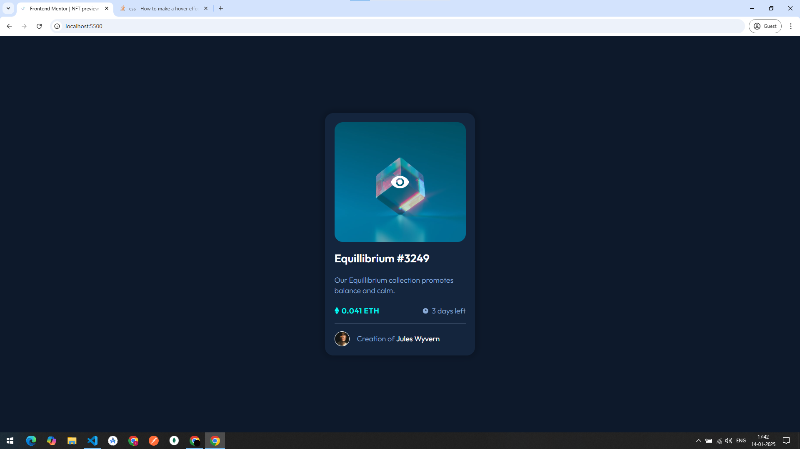

# Frontend Mentor - NFT preview card component

In this project, I have practiced some em and rem units that helped me resize the content responsive to smaller screens. Building projects like this make understanding of the design files and approach the design more strategically.


## Things I applied from my learning

With this Block of code in my `style.css` file I got to apply the active state. This project let me know the exact meaning and flow positioned elements in CSS.

```
.card-image-container::after {
  content: "";
  display: block;
  width: 100%;
  /* Size of the Image [Vertically] */
  height: 288px;

  /* Active Initials */
  opacity: 0;
  transition: all 0.33s ease-in-out;
}

.card-image-container:hover::after {
  opacity: 0.24;
  background-color: var(--accent);
}
```

## ScreenShots

> Importantly I made this by reading through some documentation I felt to understand others code base much better now.



In this I made the Hovering effect being overlayed on the image using only CSS pseudo elements.

## Things I learned:

1. I have learnt to make use of CSS `pseudo elements`.
1. Understood the flow of CSS positioning properties such as `absolute | relative`.
1. Separating various CSS files to easily manage the codebase.

## Things I am planning to do:

1. I need to incorporate more dynamic features and need to learn more about [`ARIA`](https://developer.mozilla.org/en-US/docs/Web/Accessibility/ARIA) content usuage in HTML.
1. WCAG - requirements and guidelines for Responsive Web Design.
1. Dynamic Website using Java Script.

### IMPORTANT LINKS

| Source    | Link                                                                      |
| --------- | ------------------------------------------------------------------------- |
| Live Site | [URL for GitHub Page](https://logeshwaran123.github.io/nft-preview-card/) |
| Code URL  | [Repo in GitHub](https://github.com/Logeshwaran123/nft-preview-card.git)  |
